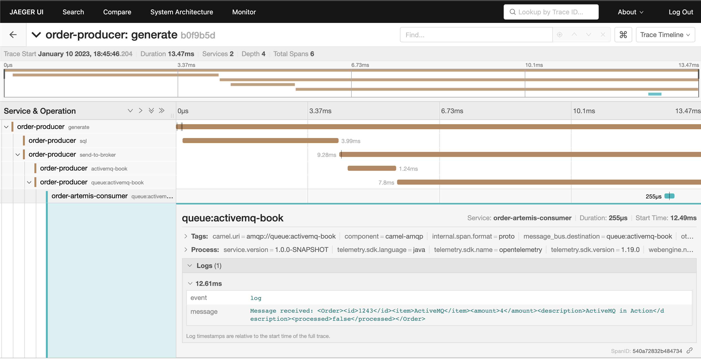

= Obversability with Camel Quarkus Artemis and Kafka

This project aims to use Apache Camel to send and consume events from Kafka (Strimzi) and Artemis message broker, capture the tracing information and display it in Jaeger. 

Also it has monitoring dashboard for Strimzi and Artemis.

Component architecture:

image::img/architecture.jpg[]

. order-producer

Each 3s save order to a MYSQL database and send the message to Kafka `camel-book`,  `activemq-book` topic and `activemq-book` and `camel-book` queue in Artemis.

. order-artemis-consumer

Consume messages from `activemq-book` and `camel-book` queue in Artemis. 

. order-consumer-producer

Consume messages from Kafka and produces in Artemis. 

Tracing with multiple applications.



Tracing FlameGraph

image::img/flamegraph.png[]

== Pre requirements

. JDK 11+
. Quarkus CLI
. Docker
. AMQ Streams Operator
. AMQ Broker Operator
. AMQ Grafana Operator
. Red Hat OpenShift distributed tracing platform

== Local development

. Init AMQ, Jaeger: `docker compose up`
. Artemis Console: ``` http://localhost:8161/console/ ```
. Jaeger Console: ```http://localhost:16686/search```  

To run the apps: 

Inside each project:

    quarkus dev

== Install the demo in Openshift with Ansible

=== Parameters

[options="header"]
|=======================
| Parameter      | Example Value                                      | Definition
| tkn     | sha256~vFanQbthlPKfsaldJT3bdLXIyEkd7ypO_XPygY1DNtQ | access token for a user with cluster-admin privileges
| server    | https://api.mycluster.opentlc.com:6443             | OpenShift Cluster API URL
|=======================

=== Deploying the demo
----
export tkn=sha256~dnMRt_XTTEdgDmO6fpi423A6as3X46_1XshCPI-zXW4
export server=https://api.cluster-h9xg5.h9xg5.sandbox72.opentlc.com:6443

ansible-playbook -e token=${tkn} -e server=${server} playbook.yml
----